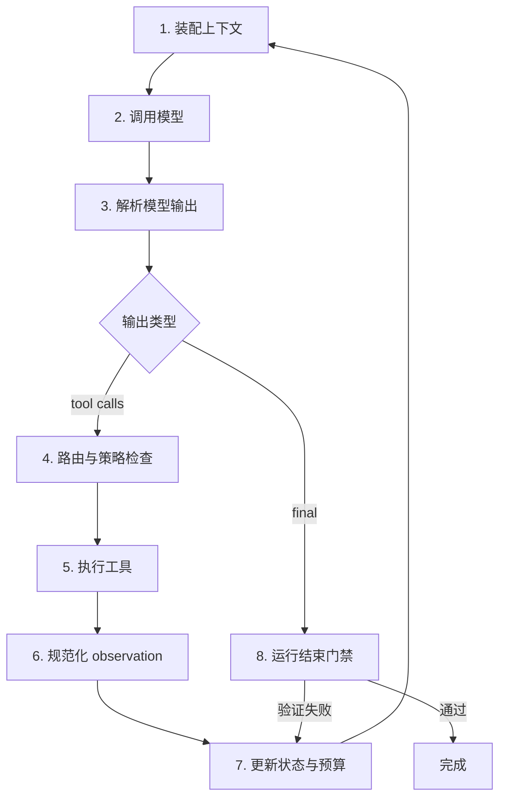

# Agent Loop：Code Agent 的控制内核

> Agent Loop 不是一个把模型 API 放进 `while` 的技巧，而是负责推进状态、执行动作、处理失败、控制预算和决定何时停止的运行时。

## 一、为什么先讲 Loop，而不是 Prompt？

聊天模型完成一次映射：

```text
输入上下文 -> 输出文本或工具调用
```

Code Agent 要完成的却是一个持续改变环境的过程：

```text
理解任务 -> 搜索仓库 -> 提出假设 -> 修改代码 -> 运行测试
        -> 读取失败 -> 修正假设 -> 再次验证 -> 交付证据
```

模型每次只产生“下一步”。把这些局部决策组织成一个可终止、可恢复的任务，是 Harness 的职责。ReAct 将这种过程表达为推理与行动交替；[OpenAI Agents SDK](https://openai.github.io/openai-agents-python/running_agents/)和[Claude Agent SDK](https://code.claude.com/docs/en/agent-sdk/agent-loop)公开的 Runner 也都采用相同核心语义：调用模型；若有工具调用则执行并回填结果；若得到最终输出则结束；达到回合或预算上限则以明确状态退出。

最小 Harness 中的循环已经抓住了这个内核：

```python
for step in range(1, MAX_STEPS + 1):
    response = client.chat.completions.create(...)
    message = response.choices[0].message
    messages.append(message)

    if not message.tool_calls:
        return

    for call in message.tool_calls:
        result = handlers[call.function.name](...)
        messages.append(tool_result(result))
```

但生产系统不能把“模型没有继续调用工具”直接等同于“任务完成”。模型可能因为误判、上下文缺失、格式错误、预算压力或接口异常而停止。Loop 必须区分：**模型结束了生成**和**系统确认任务完成**。

## 二、形式化：Loop 是带预算的状态转移系统

把第 `t` 步的运行状态记为：

```text
S_t = (G, H_t, W_t, K_t, B_t, V_t)
```

- `G`：任务目标与验收条件；
- `H_t`：提供给模型的消息与观察历史；
- `W_t`：工作区的真实状态，包括文件、进程和依赖；
- `K_t`：Harness 维护的结构化任务状态；
- `B_t`：剩余预算，如步数、Token、时间和费用；
- `V_t`：最近一次验证状态。

模型策略产生动作：

```text
a_t ~ π(a | C(S_t))
```

其中 `C` 是 Context Manager。动作经 Tool Router 和 Sandboxed Executor 执行，得到 observation：

```text
o_t = E(R(a_t), W_t)
```

Loop 再通过一个确定性的状态转移函数更新状态：

```text
S_{t+1} = T(S_t, a_t, o_t)
```

这个写法揭示了一个重要边界：模型负责提出动作，Harness 负责决定动作是否合法、怎样执行、结果如何记录以及下一轮是否仍应继续。`π` 是概率性的，`T` 应尽可能确定、可测试和可重放。

## 三、一次 Loop 里实际发生什么？

一个成熟的回合至少包含八个阶段：



### 1. 装配上下文

Loop 不应直接发送整个历史，而应向 Context Manager 请求本轮输入。输入通常包含：

- 不可丢失的系统协议；
- 用户目标与验收条件；
- 项目指令；
- 当前任务状态；
- 最近的相关观察；
- 工具定义；
- 当前预算和验证结果。

### 2. 调用模型

模型调用需要明确的超时、重试和幂等边界。网络超时与模型明确拒绝不是同一种失败：前者可以退避重试，后者应该进入阻塞或人工介入状态。若 API 在超时前可能已经返回工具调用，盲目重试还可能产生重复动作，因此模型请求也需要 `request_id` 和事件日志。

### 3. 解析输出

模型输出至少可以归入：

- 文本与零个工具调用；
- 一个工具调用；
- 多个工具调用；
- 结构化 handoff；
- 无法解析的输出；
- 内容拒绝或提供方错误。

不要让解析异常直接杀死进程。它应变成明确事件，由 Loop 根据错误类型决定重试、请求模型修正格式或停止。

### 4～6. 路由、执行与 observation

Tool Router 完成参数验证与策略判断，Sandboxed Executor 负责实际副作用，结果再被转换成统一 observation。Loop 不应该知道 `pytest` 怎样启动，也不应该自己解析每一种工具的私有返回格式；它只消费统一协议。

### 7. 更新状态与预算

这里不仅是 `messages.append(...)`。至少要更新：

- 步数、Token、费用与墙钟时间；
- 读过和改过的文件；
- 最新 diff 摘要；
- 测试与命令退出码；
- 连续失败次数；
- 最近是否产生实质进展；
- 是否需要压缩上下文；
- 是否触发验证或人工审批。

### 8. 结束门禁

模型给出 final answer 只代表它请求结束。Harness 还应检查：

```text
是否有未处理的工具调用？
是否产生了代码修改？
若修改了代码，是否有修改后的验证结果？
验证结果是否对应当前工作区状态？
是否触及禁止文件或留下未跟踪产物？
任务定义的验收条件是否已覆盖？
```

只有门禁通过，状态才从 `running` 转为 `completed`。

## 四、不要只有 running 和 done：设计显式状态机

一个实用状态机可以从下面开始：

```python
class RunStatus(StrEnum):
    CREATED = "created"
    RUNNING = "running"
    WAITING_APPROVAL = "waiting_approval"
    VERIFYING = "verifying"
    BLOCKED = "blocked"
    COMPLETED = "completed"
    FAILED = "failed"
    CANCELLED = "cancelled"
    BUDGET_EXHAUSTED = "budget_exhausted"
```

为什么需要这么多状态？因为它们的恢复策略不同：

| 状态 | 含义 | 合理后续 |
| --- | --- | --- |
| `WAITING_APPROVAL` | 有动作需要人确认 | 保留现场，等待批准或拒绝 |
| `VERIFYING` | 模型已请求结束，系统正在独立验证 | 通过则完成；失败则把证据送回 Loop |
| `BLOCKED` | 缺少凭据、需求或外部服务 | 请求明确输入，不继续猜测 |
| `FAILED` | 内部错误导致无法安全继续 | 输出错误类型和恢复点 |
| `BUDGET_EXHAUSTED` | 达到步数、费用或时间限制 | 保存 checkpoint，说明未完成 |
| `CANCELLED` | 用户或上层调度器取消 | 终止子进程并清理临时资源 |

状态机还能阻止非法转移。例如 `COMPLETED` 以后不允许继续编辑；`WAITING_APPROVAL` 不能偷偷执行待批动作；`VERIFYING` 中产生的新编辑会使已有验证结果失效。

## 五、停止条件：最容易被低估的设计

### 错误做法：没有工具调用就成功

这会产生典型 false success：模型读了两个文件，认为问题不存在，直接回复“已修复”；或者执行测试失败后，因为上下文混乱而输出总结。

### 更可靠的停止协议

让模型提交结构化结束请求：

```json
{
  "status": "request_completion",
  "summary": "Changed token TTL from seconds to minutes",
  "evidence": [
    {"type": "test", "command": "pytest -q", "expected": "exit_code=0"}
  ],
  "remaining_risks": []
}
```

Harness 不信任其中的结论，只把它当作启动 Verifier 的请求。验证通过后，Harness 再生成最终完成事件。

### 必须同时存在的硬停止条件

- 最大模型回合；
- 最大工具调用数；
- 最大总 Token 或费用；
- 最大墙钟时间；
- 单工具超时；
- 连续相同动作上限；
- 连续无进展步数；
- 用户取消；
- 安全策略触发。

硬停止不是失败处理的替代品。达到上限时应返回 `budget_exhausted`，而不是伪装成正常答案。

## 六、什么叫“有进展”？

只看步数无法识别循环。可以为每轮计算一个进展指纹：

```python
ProgressFingerprint(
    workspace_hash=hash_current_diff(),
    inspected_regions=frozenset(recent_file_ranges),
    failing_tests=frozenset(current_failures),
    hypothesis=current_hypothesis,
)
```

以下模式通常表示停滞：

- 连续三次读取同一文件的同一区间；
- 使用同样参数重复失败的工具调用；
- diff 没变化，却反复运行同一测试得到相同失败；
- 在两种修改之间来回震荡；
- 不断扩大搜索范围，但没有更新假设；
- 反复压缩后立刻重新读入同一份巨型输出。

检测到停滞后，不应只告诉模型“再试一次”。可以分级处理：

1. 返回结构化重复提示；
2. 要求模型重述当前假设和反证；
3. 回滚最近修改并切换策略；
4. 委派隔离的探索子任务；
5. 请求人工输入；
6. 以 `blocked` 结束。

## 七、工具失败不是一种错误

Loop 应按可恢复性分类，而不是统一塞入 `ERROR: ...`：

| 类型 | 示例 | 默认策略 |
| --- | --- | --- |
| 参数错误 | 缺少 `path`、行号非法 | 返回 Schema 错误，让模型修正一次 |
| 前置条件失败 | `old_text` 匹配 0 次 | 返回当前文件哈希和建议重新读取 |
| 环境错误 | 依赖未安装、命令不存在 | 判断能否在权限内修复环境 |
| 暂时错误 | API 429、短暂网络中断 | 指数退避并限制重试次数 |
| 策略拒绝 | 路径越界、危险命令 | 不自动重试；说明边界或请求审批 |
| 测试失败 | 断言失败、编译错误 | 这是有效 observation，不是系统异常 |
| 内部错误 | 日志写入失败、状态损坏 | fail closed，保存现场并停止 |

特别要注意：测试退出码非零通常是 Agent 需要的反馈，不应被当作 Tool Router 崩溃。相反，JSONL 轨迹无法持久化可能破坏审计和恢复，应比一次测试失败更严重。

## 八、并行工具调用：快，但不能破坏因果关系

模型可能在一轮中请求多个工具。只读操作通常可以并行：

```text
read_file(app.py)       ┐
read_file(test_app.py)  ├── 并行安全
git_diff()              ┘
```

有副作用或存在依赖的动作不能盲目并行：

```text
edit_file(app.py) -> run_tests()       # 测试依赖编辑完成
edit_file(a.py) || edit_file(a.py)     # 同一文件写冲突
install_dependency() -> import_check() # 环境状态依赖
```

Tool Router 可以给每个工具声明：

```python
ToolMetadata(
    read_only=True,
    idempotent=True,
    resource_keys=lambda args: {args["path"]},
)
```

Loop 根据读写集合构建一个小型依赖图：只读且资源不冲突的调用并行，其他调用串行。并行完成后仍应按原始 `tool_call_id` 把结果对应回模型，避免 observation 串线。

## 九、一个更可靠的 Loop 骨架

下面不是完整产品代码，而是模块边界示意：

```python
async def run(state: RunState) -> RunResult:
    await event_store.append(RunStarted.from_state(state))

    while state.status == RunStatus.RUNNING:
        if reason := budgets.stop_reason(state):
            return await stop(state, RunStatus.BUDGET_EXHAUSTED, reason)

        model_input = context_manager.build(state)

        try:
            model_output = await model.generate(
                model_input,
                request_id=new_request_id(),
                timeout=MODEL_TIMEOUT,
            )
        except RetryableProviderError as error:
            await retry_policy.handle(error, state)
            continue

        parsed = output_parser.parse(model_output)
        await event_store.append(ModelOutputReceived(parsed))

        if parsed.completion_request:
            state.status = RunStatus.VERIFYING
            report = await verifier.verify(state)
            state.latest_verification = report

            if report.passed:
                return await complete(state, report)

            context_manager.add_verification_feedback(state, report)
            state.status = RunStatus.RUNNING
            continue

        if not parsed.tool_calls:
            context_manager.add_protocol_error(
                state, "Return a tool call or a completion request."
            )
            continue

        results = await tool_router.dispatch(parsed.tool_calls, state)
        context_manager.add_tool_results(state, results)
        progress_detector.update(state, results)
        budgets.charge(state, model_output, results)
        await checkpoint_store.save(state)

    return RunResult.from_state(state)
```

这里有四个关键变化：

1. completion 是请求，不是事实；
2. 所有关键阶段产生事件；
3. 状态和对话历史分离；
4. 预算、进展、验证和 checkpoint 都由 Harness 控制。

## 十、事件日志：可观测性不是最后再加

建议使用 append-only event log，而不是只保存最终 messages：

```json
{"seq":1,"type":"run_started","task":"...","base_commit":"abc123"}
{"seq":2,"type":"model_requested","context_hash":"..."}
{"seq":3,"type":"tool_requested","call_id":"c1","name":"read_file","args":{}}
{"seq":4,"type":"tool_completed","call_id":"c1","exit":"success","artifact":"obs/4.txt"}
{"seq":5,"type":"workspace_changed","diff_hash":"..."}
{"seq":6,"type":"verification_completed","passed":false,"report":"verify/6.json"}
```

事件日志需要做到：

- 单调序号；
- 每个模型请求和工具调用有稳定 ID；
- 大输出存 artifact，事件只保存摘要、哈希和路径；
- 记录模型、Prompt 版本、工具版本和环境镜像；
- 能从最后一个完整事件恢复；
- 敏感字段在落盘前脱敏。

没有这些信息，“Agent 为什么失败”通常只能靠猜。

## 十一、怎样评测 Agent Loop？

不要先换模型。固定模型、工具和任务，只改变 Loop 策略。

### 实验 A：停止门禁

准备包含以下情况的任务：

- 测试从未运行；
- 测试在修改前通过、修改后未运行；
- 窄测试通过但全量回归失败；
- 工作区没有任何修改；
- 模型文本声称成功但退出码非零。

对比：

```text
A 组：无工具调用即结束
B 组：结构化 completion request + Harness verifier
```

核心指标是 `false_success_rate`，不是回复看起来是否合理。

### 实验 B：停滞检测

人为制造无法唯一匹配的编辑、缺少依赖和持续失败测试，比较是否启用重复动作检测：

- 平均无效工具调用数；
- 达到预算上限的比例；
- 成功切换策略的比例；
- 请求人工帮助前浪费的 Token。

### 实验 C：预算形状

相同总 Token 下比较：

- 10 个长回合；
- 30 个短回合；
- 动态预算：探索、编辑、验证分别限额。

这能回答“预算花在哪里”而不只是“总共花了多少”。

### 实验 D：故障注入

随机注入模型超时、工具超时、日志过长、进程被杀和临时 API 错误，检查：

- 是否产生重复副作用；
- 是否能从 checkpoint 恢复；
- 状态是否出现非法转移；
- 最终报告是否准确说明未完成。

## 十二、常见误区

### 误区 1：模型更强，Loop 可以更简单

更强模型能降低部分决策错误，却不能替代超时、取消、权限、幂等、事件日志和验证门禁。这些属于系统正确性，不属于语言能力。

### 误区 2：多 Agent 就是多个 Loop 并行

多 Agent 还需要任务分解、上下文隔离、写冲突控制、结果合并和全局预算。单 Loop 尚未稳定时，并行只会放大不可复现性。

### 误区 3：测试失败就是异常

对代码 Agent 来说，失败测试是高价值观察。真正异常的是无法执行测试、结果与工作区不对应或 Harness 丢失了退出码。

### 误区 4：最终答案由模型自由发挥

最终交付应从事件和 verifier 报告生成：修改文件来自真实 diff，验证命令来自执行记录，剩余风险来自未通过或未覆盖项。模型可以负责表达，但不应编造事实字段。

## 十三、从当前 Harness 演进的最小改动

建议下一版只做五件事：

1. 引入 `RunState` 和 `RunStatus`；
2. 把“无工具调用”改成“请求验证”；
3. 为每个工具调用加入稳定 ID、开始/完成事件和耗时；
4. 增加重复动作与无进展检测；
5. 把停止原因写入轨迹并反映在进程退出码中。

暂时不要急着加入 planner、subagent 或长期记忆。先确保单一 Loop 在失败、取消和预算耗尽时仍然行为明确。

## 十四、检查题

1. 为什么“模型输出 final answer”和“任务完成”必须是两个事件？
2. 哪些错误适合自动重试，哪些错误重试反而危险？
3. 两个 `read_file` 可以并行，为什么 `edit_file` 与 `run_tests` 通常不能并行？
4. 如果进程在工具执行成功、事件写入之前崩溃，恢复时怎样避免重复副作用？
5. 如何定义一个与具体模型无关的“无进展”信号？

## 参考资料

- [ReAct: Synergizing Reasoning and Acting in Language Models](https://arxiv.org/abs/2210.03629)
- [OpenAI Agents SDK: Running agents](https://openai.github.io/openai-agents-python/running_agents/)
- [Claude Agent SDK: How the agent loop works](https://code.claude.com/docs/en/agent-sdk/agent-loop)
- [SWE-agent: Agent-Computer Interfaces Enable Automated Software Engineering](https://arxiv.org/abs/2405.15793)
- [OpenHands: An Open Platform for AI Software Developers as Generalist Agents](https://arxiv.org/abs/2407.16741)
