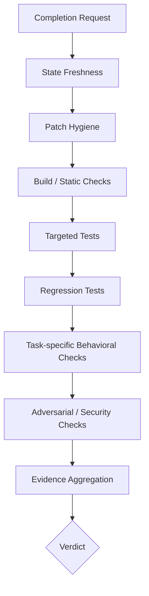

# Verifier：谁有权宣布代码任务完成？

> 生成 patch 的模型可以提出“我认为已经修好”，但最终完成状态必须来自独立、可执行、与当前工作区绑定的证据。Verifier 是 Agent 从“会修改代码”走向“结果值得相信”的关键模块。

## 一、模型主动跑测试，为什么还不够？

最小 Harness 在系统 Prompt 中写了：

```text
修改后运行最窄、最相关的测试或检查。
没有报告验证结果，就不要声称任务成功。
```

这是很好的行为引导，却不是系统保证。模型仍可能：

- 忘记运行测试；
- 只运行修改前的测试；
- 运行一个过窄、无法覆盖需求的测试；
- 测试失败后误读日志；
- 修改或删除测试以让结果变绿；
- 把“命令成功启动”误当成“测试通过”；
- 只检查实现细节，没有检查用户可观察行为；
- 在测试通过后继续编辑，使结果失效；
- 生成一段看似可信但不存在的验证摘要。

如果生成者同时是唯一裁判，系统会出现自证循环：

```text
模型写代码 -> 模型选择有利测试 -> 模型解释结果 -> 模型宣布成功
```

Verifier 的核心原则是：

```text
proposal comes from the agent
completion comes from independent evidence
```

“独立”不一定意味着另一个模型。更可靠的优先级通常是：确定性测试与规则 > 静态/动态分析 > 独立模型审查 > 生成模型自评。

## 二、Verification、Validation 和 Evaluation

这三个词经常混用，可以这样区分：

| 概念 | 问题 | 示例 |
| --- | --- | --- |
| Verification | 实现是否满足明确检查？ | 单元测试、类型检查、编译 |
| Validation | 实现是否满足用户真正需求？ | 30 分钟过期，而不只是某函数返回固定值 |
| Evaluation | Agent 系统总体表现怎样？ | 100 个任务的成功率、成本与误报率 |

Verifier 主要负责前两者，并向评测系统提供标准化结果。测试全绿可能完成 verification，却仍未完成 validation。例如 Agent 可以把测试中的期望值也改成错误结果。

## 三、Verifier 的输入必须绑定具体状态

一个验证请求不能只有 `run pytest`：

```python
@dataclass(frozen=True)
class VerificationRequest:
    run_id: str
    task_id: str
    base_commit: str
    workspace_revision: str
    patch_hash: str
    acceptance_criteria: tuple[Criterion, ...]
    changed_files: tuple[str, ...]
    environment_digest: str
    requested_checks: tuple[CheckSpec, ...]
```

结果也不能只有 `True/False`：

```python
@dataclass(frozen=True)
class VerificationReport:
    verdict: Literal["pass", "fail", "inconclusive", "infra_error"]
    workspace_revision: str
    environment_digest: str
    checks: tuple[CheckResult, ...]
    criteria_coverage: tuple[CriterionCoverage, ...]
    regressions: tuple[str, ...]
    policy_violations: tuple[str, ...]
    evidence_refs: tuple[str, ...]
    started_at: datetime
    finished_at: datetime
```

`workspace_revision` 是必要字段。只要代码再次变化，旧 report 就必须标为 stale。否则 Loop 可能用修改前的绿色测试为修改后的代码背书。

## 四、Verifier 不是一条测试命令，而是证据流水线



### 1. State Freshness

确认：

- patch hash 与当前工作区一致；
- 环境和 base commit 正确；
- 没有验证开始后产生的新修改；
- setup 已成功；
- 隐藏测试和 verifier 文件未被 Agent 修改。

### 2. Patch Hygiene

检查 patch 本身：

- 是否修改了任务范围外文件；
- 是否包含二进制、缓存、日志、密钥；
- 是否删除或跳过测试；
- 是否加入 `xfail`、`skip`、宽泛异常吞噬；
- 是否改变 CI/构建配置绕过检查；
- 是否出现大规模格式化掩盖真实改动；
- 是否修改隐藏 verifier 或评测入口。

这一步不证明正确，但能发现“通过测试的捷径”。

### 3. Build 与静态检查

- 语法/编译；
- 类型检查；
- lint；
- 依赖和锁文件一致性；
- API/ABI 检查；
- 静态安全规则。

静态检查便宜，应尽早失败；但不要把风格告警与功能错误混成一个 verdict。

### 4. Targeted Tests

运行与任务最直接相关的测试，反馈快，适合送回 Agent 迭代。它回答“最可能的修复点是否工作”。

### 5. Regression Tests

至少覆盖修改模块的回归测试，必要时运行全量套件。它回答“修复是否破坏了原来正确的行为”。

SWE-bench 的评测思想可以抽象为两组测试：原来失败、修复后应通过的 F2P；原来通过、修复后仍应通过的 P2P。只检查 F2P 会漏掉回归，只检查 P2P 又无法证明 issue 被修复。[SWE-bench](https://arxiv.org/abs/2310.06770)

### 6. Task-specific Behavioral Checks

测试仓库已有测试不一定完整覆盖 issue。Verifier 应从 acceptance criteria 构造外部可观察行为：

```yaml
criterion: token 在创建 30 分钟后过期
checks:
  - 29分59秒时仍有效
  - 30分钟边界行为符合规范
  - 30分01秒后无效
  - timezone-aware datetime 保持一致
```

不要只断言实现使用 `timedelta(minutes=...)`，因为这是实现细节；正确的替代实现也应通过。

### 7. Adversarial 与 Security Checks

根据任务风险加入：

- 边界值；
- 空输入、超长输入、Unicode；
- 并发；
- 权限绕过；
- 注入；
- 资源耗尽；
- property-based testing；
- mutation testing；
- fuzzing。

不是每个小任务都要完整安全审计。Verifier 需要分级配置，而不是一套昂贵检查运行所有任务。

## 五、Acceptance Criteria 必须可追踪

Verifier 最难的部分通常不是运行测试，而是把自然语言需求转成可判断条件。

```python
class Criterion(BaseModel):
    id: str
    description: str
    kind: Literal[
        "functional", "regression", "performance",
        "security", "compatibility", "documentation"
    ]
    verification_method: str
    mandatory: bool = True
```

报告需要逐条说明：

| Criterion | Evidence | Result |
| --- | --- | --- |
| C1：30 分钟过期 | `test_expiry_boundary` | pass |
| C2：旧行为不回归 | `pytest -q` 13 passed | pass |
| C3：不改变公共 API | signature comparison | pass |
| C4：timezone 行为 | 无覆盖 | inconclusive |

这样，“测试全绿但 C4 没有任何证据”不会被压缩成一个误导性的 `pass`。

### 谁生成 Acceptance Criteria？

- 用户明确给出的条件：最高优先级，保留原文；
- issue、测试和文档推导：标注来源；
- 模型补充的隐含条件：标注为假设，必要时请用户确认；
- 安全与工程门禁：由 Harness/项目策略提供。

不要让 Agent 在完成后悄悄重写验收标准，使自己的实现更容易通过。

## 六、确定性 Verifier、模型 Verifier 和混合 Verifier

### 确定性 Verifier

包括测试、编译、静态规则、schema、数值阈值和状态查询。

优点：可复现、可审计、反馈明确。缺点：需要任务特定设计，可能覆盖不完整，也可能把实现细节写死。

### 模型 Verifier

用独立上下文或独立模型审查需求、diff、测试和文档。

优点：能处理自然语言、设计质量和开放式标准。缺点：概率性、可能与生成模型共享盲点、容易被 patch 或日志中的文本诱导。

### 混合策略

```text
硬门禁：编译、测试、安全策略、禁止文件
        ↓
行为门禁：任务特定黑盒检查
        ↓
软评审：代码质量、可维护性、需求解释
        ↓
高风险或不确定项：人工确认
```

模型评审适合补充证据和发现遗漏，不适合覆盖确定性失败。一个 LLM 说“看起来没问题”不能把退出码 1 改成通过。

## 七、已有测试为什么也可能是错误的裁判？

从已合并 PR 挖掘出的测试通常是为某个参考修复编写的，不一定能公平判断所有替代实现：

- 正确替代方案可能被过度具体的测试拒绝；
- 不完整方案可能碰巧通过；
- 测试可能依赖未记录环境；
- 测试本身可能存在 bug；
- issue 的部分要求没有测试；
- reference patch 和讨论可能进入训练数据。

2026 年发布的 [DeepSWE](https://arxiv.org/abs/2607.07946)专门针对这类问题构造原创长任务，并为需求编写独立 verifier。论文报告中，独立 LLM 复核与其手写 verifier 的不一致率明显低于与继承式 benchmark 测试的不一致率。这说明 verifier 质量本身就是 benchmark 质量，而不是一个附属实现细节。

因此，Verifier 也需要被验证。

## 八、怎样验证 Verifier？

### 1. 正例与反例

至少准备：

- reference/gold patch；
- 未修改 baseline；
- 几个已知错误 patch；
- 正确但实现方式不同的 alternative patch；
- 只修复表面测试的 overfit patch；
- 引入回归的 patch；
- 试图篡改测试的 adversarial patch。

理想结果：接受所有符合需求的实现，拒绝所有违反任一强制条件的实现。

### 2. Mutation Testing

对正确实现自动做小变异：比较符号反转、边界偏移、删除检查、交换单位。如果 verifier 仍通过，说明测试缺少敏感性。

### 3. Differential Testing

对参考实现和候选实现生成输入，寻找输出差异。它适合纯函数、解析器、序列化和算法任务，但参考实现也可能不完整，差异需要结合规范解释。

### 4. Verifier 评测指标

```text
false_accept_rate   错误 patch 被接受
false_reject_rate   正确替代 patch 被拒绝
criterion_coverage  验收条件有证据的比例
mutation_kill_rate  变异错误被发现的比例
flakiness_rate      重复运行结果不一致
verification_cost  时间与计算资源
```

对自动代码 Agent，`false_accept_rate` 往往比 `false_reject_rate` 更危险，因为它直接导致系统错误声称成功；但过高的拒绝率会让 Agent 无休止修改正确代码，两者都需观察。

## 九、Verifier 如何给 Loop 有用反馈？

只返回 `FAILED` 会迫使模型重新探索。一个好的失败报告包含：

```yaml
verdict: fail
workspace_revision: diff:8f31
failed_stage: targeted_tests
criteria:
  C1:
    result: fail
    evidence: 29分59秒时已过期
  C2:
    result: pass
diagnosis:
  likely_files: [app.py]
  message: 边界比较使用了 >=，规范要求 >
artifacts:
  - verify/42/pytest.log
retry_recommendation: inspect_and_edit
```

反馈要说明事实，不要直接要求某个实现。比如“边界输入失败”比“把 `>=` 改成 `>`”更安全，后者可能把 verifier 的猜测当成唯一修复。

### 验证层级与反馈速度

```text
Level 0  patch hygiene          秒级
Level 1  syntax/type/lint       秒级
Level 2  targeted tests         秒到分钟
Level 3  module regression      分钟级
Level 4  full/integration       分钟到小时
Level 5  security/performance   昂贵、按风险触发
```

Loop 迭代时先使用快检查，申请 completion 时运行强门禁。这样既减少反馈延迟，也避免每次小编辑都跑全量测试。

## 十、多个候选 Patch 与 Verifier 排序

当 Agent 采样 `k` 个候选时，目标从 Pass@1 变成：

```text
generate candidates -> execute checks -> reject invalid -> rank survivors
```

Verifier 分数可以组合：

```text
score = mandatory_tests_pass
      + criterion_coverage
      - regressions
      - policy_violations
      - unrelated_patch_penalty
      - verification_uncertainty
```

强制测试失败的候选应直接淘汰，而不是靠代码风格分数补回来。[SWE-Gym](https://arxiv.org/abs/2412.21139)研究了使用 Agent 轨迹训练 verifier，并通过 verifier 支持推理时的候选选择；它体现了一个重要区别：候选集合中“存在正确 patch”与系统“能选中正确 patch”是两种能力。

### 防止选择器过拟合 Verifier

如果同一组公开测试被反复用于生成和选择，Agent 会逐渐针对测试而不是需求优化。可以采用：

- Agent 可见的开发测试；
- Agent 不可见的最终测试；
- 多样化属性检查；
- 随机化输入；
- 对测试修改的完整性保护；
- 人工抽查高分候选。

## 十一、测试安全：Verifier 也运行不可信代码

Verifier 必须使用 Sandboxed Executor。它会运行：

- Agent 修改后的代码；
- 仓库测试；
- 新生成的测试；
- 构建与安装脚本；
- 可能故意攻击评测器的 patch。

同时要隔离 Agent 与隐藏检查：

- hidden tests 不出现在 Agent 工作区；
- 验证时只读挂载或在独立环境注入；
- 结果返回必要失败信息，避免泄漏完整答案；
- Agent 不可修改 verifier 配置；
- 验证环境使用固定 digest 和资源限制。

如果 Agent 能读到隐藏测试，它解决的可能是“匹配判题器”，而不是用户任务。

## 十二、一个分层 Verifier 骨架

```python
class Verifier:
    def __init__(self, executor, checks, policy):
        self.executor = executor
        self.checks = checks
        self.policy = policy

    async def verify(self, request: VerificationRequest) -> VerificationReport:
        assert request.patch_hash == current_patch_hash()

        results: list[CheckResult] = []
        for stage in self.checks.for_task(request):
            if stage.requires_clean_snapshot:
                sandbox = await self.executor.create_from(request)

            result = await stage.run(sandbox, request)
            results.append(result)

            if result.infra_error:
                return report("infra_error", request, results)

            if result.failed and stage.fail_fast:
                return report("fail", request, results)

        coverage = map_evidence_to_criteria(request.acceptance_criteria, results)
        if any(c.mandatory and c.result != "pass" for c in coverage):
            verdict = "fail" if any(c.result == "fail" for c in coverage) else "inconclusive"
        else:
            verdict = "pass"

        return report(verdict, request, results, coverage)
```

这里特别区分 `fail` 与 `infra_error`：测试发现 patch 错误，与测试因为环境损坏没有运行，是不同结论。`inconclusive` 也很重要：没有证据不能自动视为通过或失败。

## 十三、怎样评测“强制 Verifier”是否有价值？

### 对照组

```text
A 组：Prompt 要求模型自行测试，文本结束即成功
B 组：模型提交 completion request，Harness 强制分层验证
```

### 任务类型

- 修改后未测试；
- 只跑窄测试；
- 改测试掩盖 bug；
- targeted pass、regression fail；
- 正确替代实现；
- flaky test；
- 环境 setup 失败；
- 验证后再次编辑。

### 主要指标

- `resolved_rate`；
- `false_success_rate`；
- verifier false accept/reject；
- 平均修复轮数；
- 验证成本；
- 需求 criterion coverage；
- 回归发现率；
- infra error 被错误归因给 Agent 的比例。

Verifier 可能让表面完成率下降，因为它拒绝了原本会被统计为成功的错误结果。这不是退步；需要同时观察真实通过率和误报率。

## 十四、常见误区

### 误区 1：退出码 0 就代表任务完成

它只证明那条命令按自己的定义成功。命令可能没发现任何测试、覆盖不足或根本与需求无关。

### 误区 2：测试越多，Verifier 越好

重复、脆弱或实现绑定的测试会增加成本和误拒绝。关键是 acceptance criteria coverage 与错误敏感性。

### 误区 3：让更强模型审查就够了

模型审查适合开放式质量判断，不应替代编译、测试、权限和行为断言。

### 误区 4：参考 patch 是唯一正确答案

需求通常允许多个实现。Verifier 应检查外部行为与约束，而不是文本 diff 相似度。

### 误区 5：Verifier 本身天然正确

它也有 false accept、false reject、flaky 和环境依赖，需要正例、反例、alternative patch 与 mutation testing。

## 十五、从当前 Harness 演进的最小路径

### v0.2：强制结束门禁

1. 如果工作区有修改，模型结束时自动运行配置好的测试；
2. 测试结果绑定当前 patch hash；
3. 退出码非零时把结构化失败送回 Loop；
4. 没有验证证据时不允许状态为 completed。

### v0.3：分层检查

1. patch hygiene；
2. targeted tests；
3. regression tests；
4. acceptance criteria 映射；
5. `fail`、`inconclusive`、`infra_error` 分离。

### v0.4：验证 Verifier

1. gold、错误和 alternative patches；
2. mutation testing；
3. hidden checks；
4. false accept/reject 统计；
5. 多候选 patch 排序实验。

## 十六、检查题

1. 为什么“模型主动运行了测试”仍不是强制验证？
2. 测试通过后再修改一行注释，旧报告是否仍有效？如果修改的是代码呢？
3. `fail`、`inconclusive` 和 `infra_error` 分别应怎样影响 Agent Loop？
4. 怎样设计测试，既接受正确替代实现，又拒绝对公开测试的过拟合？
5. 为什么 Verifier 的 false accept rate 是 Code Agent 的核心安全指标之一？

## 参考资料

- [SWE-bench: Can Language Models Resolve Real-World GitHub Issues?](https://arxiv.org/abs/2310.06770)
- [Agentless: Demystifying LLM-based Software Engineering Agents](https://arxiv.org/abs/2407.01489)
- [Training Software Engineering Agents and Verifiers with SWE-Gym](https://arxiv.org/abs/2412.21139)
- [DeepSWE: Measuring Frontier Coding Agents on Original, Long-Horizon Engineering Tasks](https://arxiv.org/abs/2607.07946)
- [SWE-bench evaluation harness](https://github.com/SWE-bench/SWE-bench)
- [OpenAI Agents SDK: Agent orchestration](https://openai.github.io/openai-agents-python/multi_agent/)
