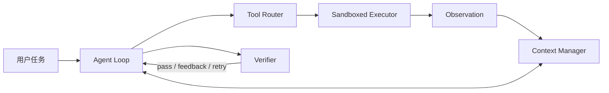

# Code Agent 核心架构：从最小 Harness 到可信执行系统

这一系列承接仓库中的[最小 Code Agent Harness 实践](../最小Code%20Agent%20Harness实践/README.md)。前一篇用约 300 行 Python 打通了最小闭环：模型观察仓库、调用工具、修改文件、运行测试，并把结果放回上下文继续决策。但“能够跑起来”只说明闭环存在，并不意味着系统可靠。

生产级 Code Agent 真正困难的地方，是把一个概率模型约束成一个能够在真实代码库中长期工作的执行系统。这个系统至少需要回答五个问题：

1. **谁推动任务前进？** 模型输出工具调用之后，谁执行、重试、停止和恢复？
2. **模型每一步能看见什么？** 上下文满了以后删什么、总结什么、永久保留什么？
3. **模型说“调用工具”之后发生什么？** 参数由谁校验，权限由谁判断，异常怎样返回？
4. **命令在哪里运行？** 如何限制文件、进程、网络、凭据和资源，防止环境反过来伤害宿主？
5. **谁有权宣布完成？** 模型的自信、测试通过和需求真正满足之间，怎样建立可信证据链？

这五个问题对应本系列的五个核心模块：



## 阅读路线

| 顺序 | 模块 | 它解决的核心问题 | 文章 |
| --- | --- | --- | --- |
| 1 | Agent Loop | 如何驱动模型、工具和环境形成有边界的状态机 | [01-Agent-Loop.md](./01-Agent-Loop.md) |
| 2 | Context Manager | 如何把有限上下文分配给当前最有价值的信息 | [02-Context-Manager.md](./02-Context-Manager.md) |
| 3 | Tool Router | 如何把模型意图安全地翻译成确定性程序调用 | [03-Tool-Router.md](./03-Tool-Router.md) |
| 4 | Sandboxed Executor | 如何让不可信命令在受控环境里获得真实反馈 | [04-Sandboxed-Executor.md](./04-Sandboxed-Executor.md) |
| 5 | Verifier | 如何用独立证据决定任务是否真的完成 | [05-Verifier.md](./05-Verifier.md) |

建议按顺序阅读。Agent Loop 是控制骨架；Context Manager 和 Tool Router 分别控制“模型看见什么”和“模型能做什么”；Sandboxed Executor 把动作限制在可接受的物理边界；Verifier 则关闭最后一个危险缺口——不再让生成答案的同一个模型独自判断自己是否正确。

## 统一的分析框架

五篇文章不按产品功能列表展开，而是使用同一组问题分析每个模块：

1. **模块边界：** 输入、输出、状态和不变量是什么？
2. **最小实现：** 当前 Harness 已经做了什么？
3. **失效方式：** 哪些失败不能靠“换一个更强模型”解决？
4. **生产设计：** 一个更可靠的实现需要哪些子组件？
5. **可观测性：** 出错时需要记录什么，才能复现和定位？
6. **评测方法：** 怎样通过 A/B 实验证明这个模块确实有价值？
7. **演进顺序：** 哪些改动适合下一版，哪些应该等基本闭环稳定以后再做？

## 公开资料通常从哪里切入？

不同资料讲 Code Agent 时，关注的是不同层级：

- [How to Build an Agent](https://ampcode.com/notes/how-to-build-an-agent)和各种百行 Agent 教程，擅长揭示最小 Loop：模型返回工具调用，程序执行后把结果送回模型；
- [SWE-agent](https://arxiv.org/abs/2405.15793)重点研究 Agent-Computer Interface，说明工具的浏览、编辑与反馈方式会直接改变任务成功率；
- [OpenAI Agents SDK](https://openai.github.io/openai-agents-python/running_agents/)和[Claude Agent SDK](https://code.claude.com/docs/en/agent-sdk/agent-loop)把 Loop 扩展成运行时，加入回合、预算、事件、权限、会话与 handoff；
- Claude Code、Codex 等产品文档更多暴露生产控制面：项目指令、上下文压缩、权限、OS Sandbox、Skills、MCP、Hooks、Subagents 和 Worktrees；
- [SWE-bench](https://arxiv.org/abs/2310.06770)、[SWE-Gym](https://arxiv.org/abs/2412.21139)和 [DeepSWE](https://arxiv.org/abs/2607.07946)则从评测反推环境与 verifier：代码是否真正解决任务，最终必须由可执行证据判断。

这些讲法并不冲突，只是观察尺度不同。本系列把它们接成一条演进链：先保留百行教程的可理解性，再逐层加入论文证明重要、成熟产品实际暴露、并且能够通过实验验证的工程机制。

## 五个模块不是五个互不相关的类

在实现中，这些模块经常互相影响：

- Tool Router 返回的日志太长，会把 Context Manager 挤爆；
- Context Manager 丢掉最近一次测试失败，Agent Loop 就可能重复错误；
- Sandboxed Executor 没有稳定的镜像与资源限制，Verifier 的结果就无法复现；
- Verifier 只返回 `failed` 而不给结构化证据，Agent Loop 很难恢复；
- Agent Loop 没有结束协议，即使 Verifier 已通过，模型也可能继续修改代码；
- 只做命令 allowlist、没有系统沙箱，Tool Router 的策略判断就会被误当成安全边界。

因此，生产系统更接近一个有反馈的控制系统，而不是五层简单调用链：

```text
任务目标
   ↓
Agent Loop 选择下一步
   ↓
Tool Router 校验意图与策略
   ↓
Sandboxed Executor 改变环境
   ↓
Context Manager 选择并保存观察
   ↓
Verifier 产生独立正确性信号
   └──────────────→ Agent Loop 决定继续、回滚、求助或结束
```

## 与现有最小 Harness 的对应关系

当前的 [`mini_code_agent.py`](../最小Code%20Agent%20Harness实践/mini_code_agent.py) 已经有五个模块的种子，但成熟度不同：

| 模块 | 当前实现 | 主要缺口 |
| --- | --- | --- |
| Agent Loop | 最多 20 步的 `for` 循环；模型无工具调用时结束 | 没有显式状态、停止原因、重试分类、取消和恢复 |
| Context Manager | 完整线性 `messages` 历史；单次工具输出按字符截断 | 没有预算分配、结构化状态、压缩、去重和来源追踪 |
| Tool Router | 静态工具表、名称查找、JSON 参数解码、异常转 observation | 没有严格 Schema、策略引擎、幂等性、并发和统一结果协议 |
| Sandboxed Executor | 工作区路径检查、命令首词 allowlist、人工确认、超时 | 不是系统级隔离；没有网络、进程、资源和凭据边界 |
| Verifier | Prompt 要求模型主动运行测试 | Harness 不强制验证；模型仍然可以在没有证据时结束 |

这个差距表也是整个系列的实践路线。目标不是一次性复制 Claude Code 或 Codex，而是让每个新增机制都有对应失败案例、测试和指标。

## 一个贯穿系列的任务状态

随着 Harness 变复杂，仅保存聊天消息会越来越难维护。系列中会反复使用下面这个抽象状态：

```python
@dataclass
class RunState:
    run_id: str
    task: str
    phase: Literal["explore", "edit", "verify", "done", "blocked"]
    step: int
    messages: list[dict]
    facts: list[Fact]
    changed_files: set[str]
    latest_verification: VerificationReport | None
    budgets: BudgetState
    stop_reason: str | None = None
```

这里最重要的不是字段名，而是把三类东西分开：

- **对话历史**：为了让模型继续生成而存在，可以压缩；
- **任务状态**：为了让系统正确运行而存在，不能只依赖模型记忆；
- **执行证据**：工具调用、退出码、diff、测试报告等不可由摘要随意改写的事实。

只要这三类信息仍混在一个 `messages` 数组里，后续的恢复、验证和审计都会变得脆弱。

## 评价一个 Harness，不只看最终通过率

完成率当然重要，但它会掩盖系统性问题。建议为五个模块建立共同指标：

| 维度 | 指标示例 |
| --- | --- |
| 结果 | `resolved_rate`、`false_success_rate`、`regression_rate` |
| 效率 | Token、模型调用数、工具调用数、墙钟时间、验证时间 |
| 稳定性 | 重复调用率、无进展步数、超时率、恢复成功率 |
| 修改质量 | 修改文件数、patch 大小、无关改动比例、回滚次数 |
| 安全 | 越权请求数、被阻止操作数、网络访问、敏感信息暴露 |
| 可复现 | 相同提交和环境下重复执行结果的一致率 |

尤其需要记录 `false_success_rate`：Agent 声称成功，但独立 verifier 没有通过的比例。它比“最后回复写得是否自信”更能说明 Harness 是否值得信任。

## 本系列的取舍

文章会引用 Claude Code、Codex、OpenAI Agents SDK、Claude Agent SDK、SWE-agent、SWE-bench、SWE-ReX、OpenHands、Agentless 和 SWE-Gym 等公开资料，但不会猜测闭源产品未公开的内部代码。产品文档用于观察成熟系统暴露了哪些控制面；论文用于理解可控实验揭示的因果关系；当前仓库的最小 Harness 则用于把这些设计压缩成可以自己实现和验证的版本。

所有产品行为与在线文档最后核对日期为 **2026-08-18**。动态产品能力可能变化，文章重点是可迁移的架构原则，而不是某个版本的按钮位置。
