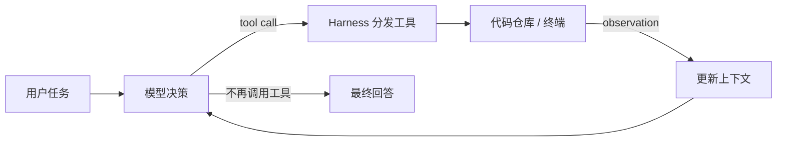

# 从零构建一个 Code Agent：模型是大脑，Harness 才是身体

> 本文不复刻 Claude Code、Codex 或其他商业产品，而是用一个约 300 行的 Python 项目，拆开 Code Agent 最核心的工作机制：模型如何观察代码库、调用工具、修改文件、执行测试，并根据反馈继续行动。

## 导入：会写代码的模型，为什么还不等于 Code Agent？

把一个报错和一段代码发给大模型，它往往可以给出不错的修改建议。但真正的 Code Agent 面对的不是一道孤立的代码题，而是一个它从未见过的仓库：

- 它要先找到相关文件；
- 理解代码和测试之间的关系；
- 决定下一步读什么、搜什么、改什么；
- 调用终端验证修改；
- 失败后读取报错，再调整方案；
- 最后说明改了什么，以及凭什么认为任务完成了。

模型本身只负责生成下一步决策。把模型连接到文件系统、终端、上下文和验证流程的那层软件，才是 **Agent Harness**。

可以把它写成一个简单公式：

```text
Code Agent = Model + Harness 
```

其中：

- **Model** 负责理解任务和选择下一步行动；
- **Harness** 负责组织循环、定义工具、维护上下文、控制预算并记录轨迹；
  
很多 Code Agent 的差距，不只来自模型能力，也来自 Harness 是否给了模型合适的观察、动作和反馈。

这篇文章将从零实现一个最小但完整的 Harness。它不是生产级产品，却足以回答一个关键问题：**一个基础模型究竟怎样在 Harness 的帮助下，变成能够进入仓库干活的 Code Agent？**

---

## 一、先确定目标：这个最小 Harness 要做到什么？

我们给它一个本地代码仓库和一句自然语言任务，例如：

```text
修复 token 过期时间单位错误，并运行测试验证。
```

Agent 应当能够完成下面的闭环：



为了让这条链路跑通，我们只实现五个工具：

| 工具 | 作用 | 为什么需要 |
| --- | --- | --- |
| `list_files` | 查看目录结构 | 建立对陌生仓库的第一印象 |
| `read_file` | 按行读取文件 | 获取局部、可控的代码上下文 |
| `search_code` | 搜索关键字 | 快速定位符号和调用关系 |
| `edit_file` | 精确替换文本 | 对文件执行最小修改 |
| `run_command` | 运行测试或检查 | 从真实环境获得验证反馈 |

这五个工具覆盖了最小的软件修复流程：

```text
定位 -> 阅读 -> 修改 -> 验证 -> 根据结果继续迭代
```

我们还会加入四条工程约束：

1. 所有文件操作必须限制在指定工作区内；
2. 终端命令需要命中允许列表，并由用户确认；
3. 工具输出必须截断，避免一次日志耗尽上下文；
4. Agent 最多运行 20 步，同时把每一步写入 JSONL 轨迹。

---

## 二、项目结构

完整代码已经放在当前目录：

```text
最小Code Agent Harness实践/
├── README.md
├── mini_code_agent.py
├── requirements.txt
├── pytest.ini
├── tests/
│   └── test_harness.py
└── examples/
    └── token_ttl_bug/
        ├── app.py
        └── test_app.py
```

- [`mini_code_agent.py`](./mini_code_agent.py)：完整 Harness；
- [`tests/test_harness.py`](./tests/test_harness.py)：文件边界、搜索、编辑和截断测试；
- [`examples/token_ttl_bug`](./examples/token_ttl_bug)：给 Agent 实际修复的微型仓库。

安装依赖：

```bash
cd "最小Code Agent Harness实践"
python3 -m venv .venv
source .venv/bin/activate
pip install -r requirements.txt
```

配置一个支持 Chat Completions 工具调用格式的模型接口：

```bash
export LLM_API_KEY="你的 API Key"
export LLM_MODEL="你的模型名称"

# 使用兼容接口时再设置：
export LLM_BASE_URL="https://你的服务地址/v1"
```

不同服务商对“兼容接口”和工具调用的支持程度可能不同；如果使用非默认接口，需要以服务商文档为准。

---

## 三、第一块积木：把文件操作锁在工作区

Agent 不应该获得整台电脑的任意文件权限。最简单的边界，是给它指定一个 workspace，并拒绝任何越界路径：

```python
class Workspace:
    def __init__(self, root: str) -> None:
        self.root = Path(root).expanduser().resolve()
        if not self.root.is_dir():
            raise ValueError(f"Workspace does not exist: {self.root}")

    def resolve(self, relative_path: str) -> Path:
        path = (self.root / relative_path).resolve()
        if path != self.root and self.root not in path.parents:
            raise ValueError(f"Path escapes workspace: {relative_path}")
        if ".git" in path.relative_to(self.root).parts:
            raise ValueError("Direct access to .git is not allowed")
        return path
```

这里不能只检查字符串是否以 `../` 开头，因为软链接、绝对路径和多层跳转都可能绕过简单判断。先调用 `resolve()` 得到规范化绝对路径，再确认它仍是 workspace 的子路径，边界才更可靠。

不过要注意：这只约束了我们自己实现的文件工具，**还不是真正的系统沙箱**。后面的终端工具仍然可能访问外部路径，生产环境需要容器、虚拟机或操作系统级隔离。

---

## 四、第二块积木：给模型一组小而明确的工具

### 1. 有边界地读取文件

不要一上来把整个仓库塞进上下文。`read_file` 默认最多读取 250 行，并附上行号：

```python
def read_file(ws: Workspace, path: str, start_line: int = 1, end_line: int = 250) -> str:
    file_path = ws.resolve(path)
    if not file_path.is_file():
        raise ValueError(f"Not a file: {path}")

    lines = file_path.read_text(encoding="utf-8", errors="replace").splitlines()
    selected = lines[start_line - 1 : end_line]
    numbered = [
        f"{number}: {line}"
        for number, line in enumerate(selected, start=start_line)
    ]
    return truncate("\n".join(numbered) or "<empty file>")
```

行号不仅方便模型定位，也为以后实现 patch、诊断信息和代码引用打下基础。

### 2. 用“唯一匹配”降低误修改概率

最小版本不实现复杂 diff，而是让模型提交 `old_text` 和 `new_text`。只有旧文本恰好出现一次时才允许修改：

```python
def edit_file(ws: Workspace, path: str, old_text: str, new_text: str) -> str:
    file_path = ws.resolve(path)
    content = file_path.read_text(encoding="utf-8")
    count = content.count(old_text)

    if count != 1:
        raise ValueError(f"old_text must match exactly once; found {count} matches")

    file_path.write_text(content.replace(old_text, new_text, 1), encoding="utf-8")
    return f"Updated {path}"
```

这条限制看起来保守，却能避免模型给出过短片段时，一次替换掉多个相同位置。工具报错也不是坏事：错误会作为 observation 返回给模型，模型可以读取更多上下文后重新尝试。

### 3. 终端工具必须受控

测试和编译是 Code Agent 获取真实反馈的关键，但 shell 也是风险最高的入口。本项目做了三层最小控制：

```python
ALLOWED_COMMANDS = {
    "git", "pytest", "python", "python3", "ruff",
    "npm", "pnpm", "yarn", "go", "cargo",
}

def run_command(ws: Workspace, command: str) -> str:
    argv = shlex.split(command)
    if not argv or argv[0] not in ALLOWED_COMMANDS:
        raise ValueError("Command not allowed")

    approved = input("Approve? [y/N] ").strip().lower() == "y"
    if not approved:
        return "Command rejected by user"

    completed = subprocess.run(
        argv,
        cwd=ws.root,
        capture_output=True,
        text=True,
        timeout=60,
        shell=False,
    )
    return truncate(completed.stdout + completed.stderr)
```

- 只允许常见开发命令；
- 每次执行前让用户确认；
- 使用 `shell=False`，并设置 60 秒超时。

这仍然不是完整安全方案。比如 `python -c` 可以执行任意 Python，`git` 也有远程和配置相关能力。允许列表只能降低误操作概率，不能替代真正的 sandbox。

---

## 五、最核心的部分：Agent Loop

工具本身并不会自动工作。Harness 的核心，是不断重复下面四步：

1. 把任务和历史消息发给模型；
2. 模型返回文本或一个/多个工具调用；
3. Harness 执行工具，把结果作为 observation 放回消息历史；
4. 模型根据最新观察继续决策，直到给出最终回答或耗尽预算。

这个循环的核心代码并不长：

```python
messages = [
    {"role": "system", "content": SYSTEM_PROMPT},
    {"role": "user", "content": task},
]

for step in range(1, MAX_STEPS + 1):
    response = client.chat.completions.create(
        model=model,
        messages=messages,
        tools=TOOLS,
    )
    message = response.choices[0].message
    messages.append(message.model_dump(exclude_none=True))

    if not message.tool_calls:
        print(message.content)
        return

    for call in message.tool_calls:
        name = call.function.name
        arguments = json.loads(call.function.arguments)
        result = handlers[name](**arguments)
        messages.append({
            "role": "tool",
            "tool_call_id": call.id,
            "name": name,
            "content": result,
        })
```

这就是最小 Code Agent 的“心脏”。它与 ReAct 的结构一脉相承：模型产生 action，环境返回 observation，新的 observation 又改变下一轮决策。

真实实现还处理了三件容易被教程忽略的事：

- **工具异常不会让进程直接崩溃。** 异常被转换成 observation，让模型有机会恢复；
- **循环有最大步数。** 本文设置为 20，防止模型无休止搜索或重复失败；
- **每个事件都会写入轨迹。** 任务、模型输出和工具结果记录在 `.mini-agent-trace.jsonl` 中。

---

## 六、System Prompt 不是“人设”，而是运行协议

这个最小 Harness 的系统提示词只有七条：

```text
1. 修改前先检查相关代码。
2. 只做与任务直接相关的最小改动。
3. 优先搜索和分段读取，不要一次读取大量文件。
4. 修改后运行最窄、最相关的测试或检查。
5. 没有报告验证结果，就不要声称任务成功。
6. 工具失败后先理解错误，不要盲目重复。
7. 最后总结修改文件、修改原因、验证方式和剩余不确定性。
```

它的作用不是让模型“表现得像程序员”，而是定义 Agent 与环境交互时必须遵守的协议。好的 Agent Prompt 通常会说明：

- 什么时候应该先搜索；
- 什么情况下可以编辑；
- 修改后怎样验证；
- 遇到失败怎样恢复；
- 最终结果必须包含哪些证据。

工具决定 Agent **能做什么**，提示词决定它 **倾向于怎样做**，环境和权限决定它 **实际上被允许做什么**。

---

## 七、运行一个真实的修复任务

示例项目里有一个故意留下的时间单位错误：

```python
TOKEN_TTL_MINUTES = 30

def token_expires_at(created_at: datetime) -> datetime:
    return created_at + timedelta(seconds=TOKEN_TTL_MINUTES)
```

变量表示 30 分钟，代码却把它当成 30 秒。对应测试要求 token 在 30 分钟后过期。

先确认测试确实失败：

```bash
cd examples/token_ttl_bug
pytest -q
```

预期结果：

```text
FAILED test_app.py::test_token_expires_after_thirty_minutes
1 failed
```

回到 Harness 目录，让 Agent 接管这个微型仓库：

```bash
python mini_code_agent.py examples/token_ttl_bug \
  "修复 token 过期时间单位错误。先理解代码和测试，只做最小修改，并运行测试验证。"
```

当 Agent 请求运行 `pytest` 时，终端会显示待执行参数并询问：

```text
[approval required] Run in .../examples/token_ttl_bug: ['pytest', '-q']
Approve? [y/N]
```

确认后，一个合理的执行轨迹通常是：

```text
step 1  list_files(path=".")
step 2  read_file(path="app.py")
step 2  read_file(path="test_app.py")
step 3  run_command(command="pytest -q")
        -> 1 failed
step 4  edit_file(
          path="app.py",
          old_text="timedelta(seconds=TOKEN_TTL_MINUTES)",
          new_text="timedelta(minutes=TOKEN_TTL_MINUTES)"
        )
step 5  run_command(command="pytest -q")
        -> 1 passed
step 6  输出修改摘要和验证结果
```

最终 diff 应当只有一行：

```diff
-    return created_at + timedelta(seconds=TOKEN_TTL_MINUTES)
+    return created_at + timedelta(minutes=TOKEN_TTL_MINUTES)
```

需要强调：上面的步骤是**典型轨迹示意，不是对任意模型的固定承诺**。不同模型可能先搜索、先运行测试，或使用不同的工具组合。真正应该观察的不是它是否一字不差地复现轨迹，而是：

1. 是否先获得了足够证据再修改；
2. 是否把改动控制在任务范围内；
3. 是否使用测试闭环验证；
4. 失败后是否能根据 observation 调整；
5. 最终结论是否与真实验证结果一致。

这也是评估 Harness 的基本方法。

---

## 八、这个最小实现已经解决了什么？

虽然只有一个文件，它已经具备 Code Agent 的基本骨架：

| 能力 | 本文实现 |
| --- | --- |
| 任务输入 | 自然语言任务 + 工作区路径 |
| 环境观察 | 文件树、文件片段、代码搜索、命令输出 |
| 行动空间 | 读取、搜索、精确编辑、执行开发命令 |
| 交互循环 | tool call → execution → observation → next step |
| 上下文 | 完整线性消息历史 |
| 预算 | 最多 20 个模型回合、命令 60 秒超时 |
| 人机协作 | 高风险终端动作逐次确认 |
| 可观测性 | JSONL 轨迹日志 |
| 验证 | 由 Agent 主动运行测试，并读取退出码和输出 |

你可以运行 Harness 自己的测试，确认文件边界、唯一匹配编辑和输出截断确实生效：

```bash
pytest -q tests
```

---

## 九、它离 Claude Code、Codex 这类产品还有多远？

很远。这正是最小实现的价值：当复杂功能被拿掉以后，缺失的工程层会变得非常清楚。

### 1. 它没有真正的沙箱

工作区路径检查只保护文件工具，无法完整约束子进程。生产系统通常还需要：

- 容器或虚拟机隔离；
- 网络访问策略；
- CPU、内存、磁盘和运行时间限制；
- 凭据注入与敏感信息脱敏；
- 写入范围控制和可恢复快照。

### 2. 它使用线性上下文

所有消息不断追加，仓库稍大就会遇到上下文膨胀。下一步应加入：

- 旧工具输出裁剪；
- 任务状态摘要；
- 已读文件索引；
- 保留失败原因、关键 diff 和最新测试结果；
- 必要时从日志恢复，而不是把所有历史永远塞给模型。

### 3. 编辑器过于简单

精确文本替换适合教学，但不适合大范围重构。可以继续实现：

- unified diff / patch；
- 新建、移动和删除文件；
- 语法树级编辑；
- 修改前快照和失败回滚；
- 自动格式化与 diff 预览。

### 4. 验证仍然依赖模型主动发起

当前 Prompt 要求模型运行测试，但 Harness 没有强制 verifier。更可靠的做法是：模型结束前，由 Harness 自动执行预设检查，并以退出码决定是否允许报告成功。

### 5. 没有针对长任务的恢复机制

真实任务需要 checkpoint、重试策略、人工接管和跨会话恢复。单一的 20 步循环只能处理很小的练习。

---

## 十、下一步怎么把它从 0.1 演进到 1.0？

不要一上来增加十几个工具。更好的方式，是让每次真实失败推动一个机制升级：

### 阶段 1：让最小闭环稳定

- 为每个工具补单元测试；
- 统一错误结构；
- 记录 token、耗时、步数和命令退出码；
- 使用 10 个小 bug 建立自己的回归任务集。

### 阶段 2：加入上下文管理

- 工具输出按类型裁剪，而不是统一按字符数截断；
- 当上下文达到阈值时生成结构化摘要；
- 保留任务目标、已修改文件、待办事项和最近一次验证结果。

### 阶段 3：强化环境和安全

- 把任务放进临时容器；
- 默认关闭网络；
- 每个任务使用独立工作树；
- 对危险动作引入审批策略，而不是只看命令首词。

### 阶段 4：把“完成”交给 verifier

- 自动运行项目预设测试；
- 保存修改前后的测试差异；
- 检查是否引入无关文件；
- 对多个候选 patch 进行测试和排序。

### 阶段 5：再考虑高级 Agent 架构

- planner / executor 分离；
- 子 Agent；
- 长期记忆；
- skills；
- 多模型路由；
- 并行探索和候选合并。

如果最小闭环还不稳定，过早加入多 Agent 往往只会把错误放大，也会让问题更难定位。

---

## 十一、回头看：Harness 的本质是什么？

写完这个项目后，会发现 Code Agent 并没有神秘的“自主意识”。它的基本过程非常朴素：

```text
模型提出下一步动作
        ↓
Harness 检查并执行动作
        ↓
环境返回真实结果
        ↓
Harness 把结果交还模型
        ↓
模型继续决策，直到通过验证
```

真正困难的部分，不是写出 `while` 循环，而是设计循环周围的约束：

- 给模型哪些工具，工具粒度应该多大；
- 一次返回多少代码和日志；
- 哪些动作可以自动执行，哪些必须审批；
- 上下文满了以后保留什么；
- 怎样定义成功，以及谁有权宣布成功；
- 失败时怎样重试、回滚和恢复。

所以，模型是 Code Agent 的大脑，而 Harness 决定这个大脑能看见什么、能做什么、做错以后会发生什么，以及它的结果是否值得相信。

理解并亲手实现这个最小闭环，是继续研究 Tool Use、Context Compaction、Memory、Subagent、Sandbox 和 Evaluation 的最好起点。

如果要继续把这个最小实现演进为更可靠的系统，可以回到[仓库首页的 Code Agent 架构系列 01–14](../README.md#code-agent-架构系列)：先补齐 Agent Loop、Context Manager、Tool Router、Sandboxed Executor 和 Verifier，再继续实现代码库理解、编辑事务、计划、跨会话恢复、可观测性、评测、多 Agent、扩展机制与安全。

---

## 参考资料

- [Thorsten Ball: How to Build an Agent](https://ampcode.com/notes/how-to-build-an-agent)
- [Mihail Eric: How to Code Claude Code in 200 Lines](https://www.mihaileric.com/The-Emperor-Has-No-Clothes/)
- [mini-SWE-agent](https://github.com/SWE-agent/mini-swe-agent)
- [Learn Claude Code](https://github.com/shareAI-lab/learn-claude-code)
- [Build Your Own Agent Harness](https://www.byoharness.dev/chapters/01-the-agent-loop.html)
- [Vercel Academy: Build an AI Agent Harness](https://vercel.com/academy/build-ai-agent-harness)

> 本文代码用于教学。不要在包含私钥、生产凭据或重要未提交改动的目录中直接运行；在真实项目中使用前，请先加入系统级沙箱、备份与更严格的审批策略。
